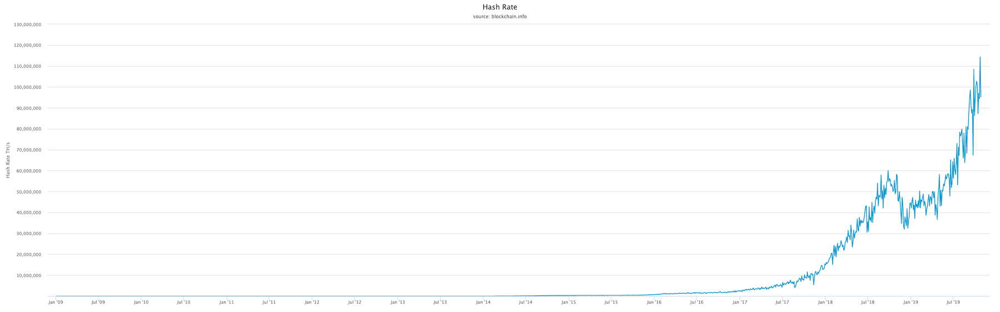
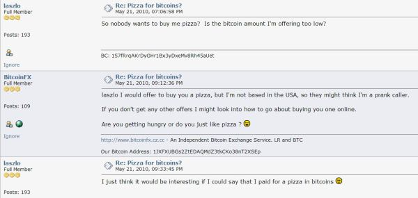
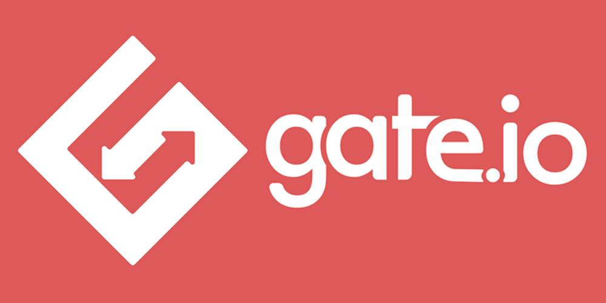
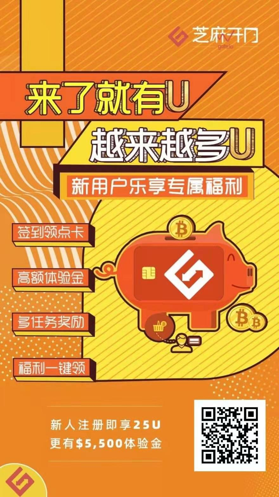
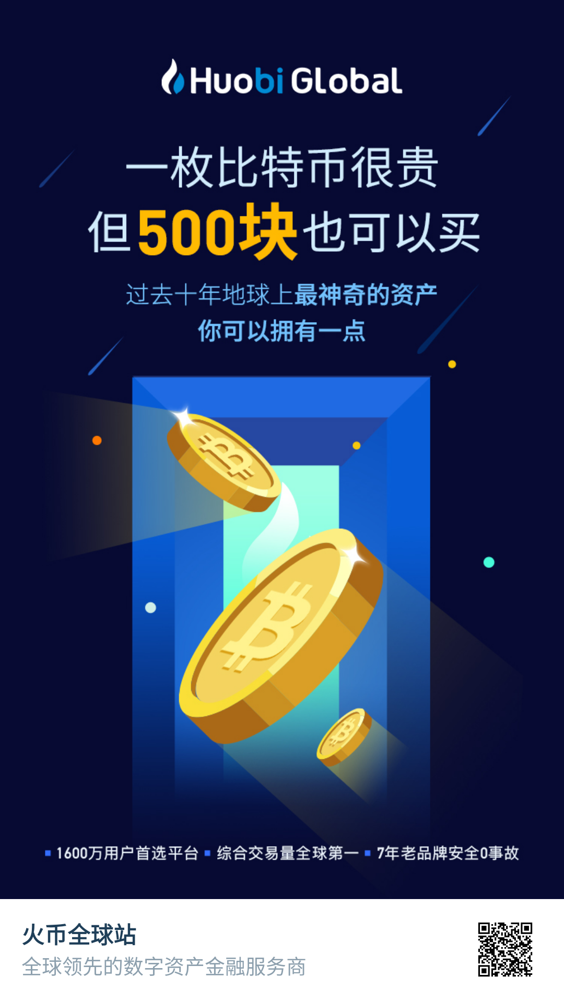
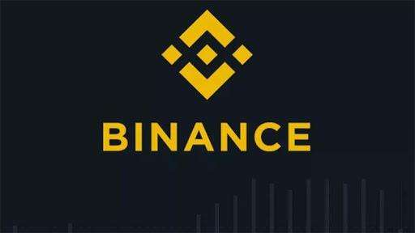
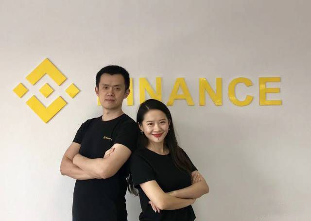
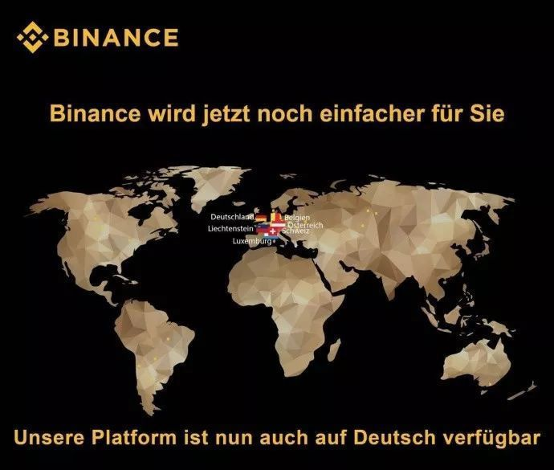
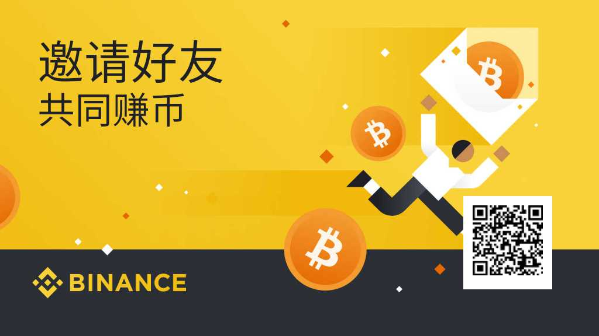
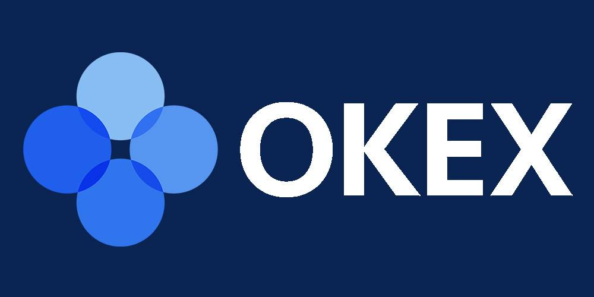

# 区块链学院 (Qkledu.com)

-----

## 警告

> 区块链作为金融互联网新技术，不可避免地会涉及到投资和投机 —— 而对绝大多数普通人来说：
>
> > **投资有风险，决策需谨慎！**

## 前言

[新华社北京10月25日电](http://www.xinhuanet.com/politics/2019-10/25/c_1125153665.htm)，中共中央政治局10月24日下午就区块链技术发展现状和趋势进行第十八次集体学习。

> 中共中央总书记习近平在主持学习时强调，区块链技术的集成应用在新的技术革新和产业变革中起着重要作用。我们要把区块链作为核心技术自主创新的重要突破口，明确主攻方向，加大投入力度，着力攻克一批关键核心技术，加快推动区块链技术和产业创新发展。
>
> 习近平在主持学习时发表了讲话。他指出，区块链技术应用已延伸到数字金融、物联网、智能制造、供应链管理、数字资产交易等多个领域。目前，全球主要国家都在加快布局区块链技术发展。我国在区块链领域拥有良好基础，要加快推动区块链技术和产业创新发展，积极推进区块链和经济社会融合发展。
>
> 习近平强调，要强化基础研究，提升原始创新能力，努力让我国在区块链这个新兴领域走在理论最前沿、占据创新制高点、取得产业新优势。要推动协同攻关，加快推进核心技术突破，为区块链应用发展提供安全可控的技术支撑。要加强区块链标准化研究，提升国际话语权和规则制定权。要加快产业发展，发挥好市场优势，进一步打通创新链、应用链、价值链。要构建区块链产业生态，加快区块链和人工智能、大数据、物联网等前沿信息技术的深度融合，推动集成创新和融合应用。要加强人才队伍建设，建立完善人才培养体系，打造多种形式的高层次人才培养平台，培育一批领军人物和高水平创新团队。
>
> ……

这些年来，人们对区块链的误解甚至诋毁现在终于可以烟消云散了 —— 因为区块链技术终于在中国获得了认可与支持。

然而，需要注意的是，区块链技术作为金融互联网新技术，不可避免地与投机（或投资）联系在一起，导致的结果是市场上骗局丛生，行业里鱼龙混杂，所以有必要让民众对区块链有正确且清楚的了解。这就是《区块链学院》的意义 —— 它就是写给小白的，目的不仅是为了让小白少走弯路，更是为了让小白不要误入歧途。

## 比特币

比特币是个前所未有的东西，所以绝大多数人很难清楚地理解它。这一个章节之中，我们会用极为简单的语言尽量做到通俗易懂 —— 并且，尽量不涉及那些晦涩难懂的技术概念。

### 1. 什么是比特币

2009 年，[比特币](https://bitcoin.org)横空出世，绝大多数人对此全然不知。即便是在 11 年后的今天，比特币对大众来说也依然神秘…… 不过，总是可以用很简单的方式说清楚：

> 理解比特币最简单的方法是把它想象成一家世界银行：

> > 这家叫 Bitcoin 的世界银行发行了一个叫作 BTC 的货币……

基于翻译的局限，无论是 Bitcoin 还是 BTC，在中文之中都叫 “比特币”。

对中国民众来说，最大的狐疑来自于 “银行是谁都可以开的么？”，以及 “货币这东西你说发就发啊？”…… 刚开始的时候这确实难以理解，甚至难以接受。可科技发展已经给我们演示过很多次 “过去完全不可能的事情竟然就那么发生了！” 电子邮件就那样悄无声息地替代了书信，互联网语音通讯就那么不声不响地替代了电话。

### 2. 比特币的总量和价值

比特币（英文名：bitcoin，简写为：BTC）是世界上第一个基于区块链技术的去中心化加密货币，从2008年由中本聪发明至今已经历时10年时间。

比特币是虚拟货币，总量被设定为2100万枚，并且总量固定，比特币玩家可以购买特殊的显卡矿机挖掘比特币，每4年挖掘数量减半，直至2100万枚挖完位置，到目前为止，比特币已经减半了2次，被挖掘出来了1700多万枚，仅仅还剩400万枚左右待挖，据有人预计，最后一枚比特币将在2140年被挖掘出来。

比特币最初在2009年的时候，1美元=1300枚比特币，2011年 1美元=1个比特币，2013年 900美元=1个比特币，2017年8月20日 约3880美元=1个比特币，历史上比特币最高价为2017年12月17日，19756美元一枚比特币。2018年9月17日，比特币从最高价至今已经下跌了68%。

虽然2018年以来，比特币的价格一路走跌，但是由于中途也经历了几次较大的反弹，许多投资者对比特币的热度依旧不减。并且有人认为比特币将会成为独立于各国法币之外的一种新型货币。

比特币最开始仅在暗网中流通，但是发展时至今日，比特币已经打破了流通限制，世界上很多商户也允许比特币支付。

### 3. 比特币其实不可能替代法币

对于新生事物，人们总是过于两极分化，要么断然拒绝接受，要么对它寄予过分的期待。比特币不可能替代法币（Fiat Money，法定货币）—— 只因为最简单的原因：

> 日常生活中人们需要的货币必须是价格相对稳定的。

在可预见的未来相当长一段时间里，比特币的价格不可能稳定；恰恰相反，它的价格波动剧烈 —— 仅此一点，就使得它没办法成为日常生活中人们所最普遍使用的货币。

长期来看，即便比特币的价格因为绝大多数人都接受而趋于稳定，它也只不过会成为地球上众多货币之中的一个而已，仍旧不可能替代所有法币。

### 4. 比特币解决了什么问题

如果你有兴趣耐心反复阅读比特币白皮书，那么你就会发现一个你之前并不了解的概念是它的核心：

> 双花问题（[Double Spending](https://zh.wikipedia.org/zh-hans/%E9%9B%99%E9%87%8D%E6%94%AF%E4%BB%98)）

简单讲，就是“同一笔钱一次只能花在一个地方”，“绝对不能让同一笔钱竟然同时花到了两个地方”，否则就只能是 “记账有误”。银行的核心业务是什么呢？银行的最核心业务其实只有一个，那就是：**记账** —— 绝对不能记错账，更不应该做假账。

数字时代的尴尬在于，传统中心化管理的数据库，用来记账的时候，那账簿是有无数种可能被篡改的，账本上随意增加一条不合理的记录、随意删除一条不合规的记录，随意修改任何记录中的数字，都有可能违规且干脆无法防范……

那怎么办呢？比特币这家世界银行的解决方案很简单：

> * 我不自己管理数据库了；
> * 把这个数据库的管理权限交给所有人，大家共同维护这个账簿；
> * 每个人手中所持有的账簿必须与其他人的一样才算有效账簿；
> * 所以，全网所有的账簿都只能一样；
> * 所以，没有人可以私自篡改账簿并被所有其他人接受……

如此这般，就保证了这家世界银行的账簿不可能出错，不可能被恶意篡改，不可能再出现任何 “同一笔钱竟然同时花在两个地方” 的情况。

于是，逻辑就很清晰了：

> * **问题**是 “必须要有一个不可篡改的可信账簿……”
> * **解决方案**是 “那我们分布式管理罢！”

你看，“去中心化” 并非目标，而是分布式管理的结果；而 “公开透明” 也只是分布式管理的自然而然的结果…… 多年以来，不明就里的人们总是神话 “去中心化” 带来的颠覆，总是神话 “公开透明” 的各种优势 —— 其实是本末倒置了。去中心化指的是网络结构去中心化，不会直接带来任何颠覆。而公开透明，固然在一些地方必需必要，但，事实上绝大多数商业模式在公开透明的方式下无法良好运营。别说商业模式了，连游戏都是这样的，猜大小游戏可以一直公开透明，可棋牌游戏，必须等到游戏结束之后才可以公开透明，否则游戏就无法进行了……

### 5. 区块链究竟是什么

区块链是 blockchain 这个英文新词汇的 “生硬翻译” —— 事实上，绝大多数翻译就是很生硬的，你看看上面的 “双花”（Double Spending）就能感觉到了。

所谓**区块**，是 *block* 的翻译，可以理解为 “信息块”（这个单词在计算机领域就是这个意思）。

> **block**, *Computing*: a large piece of text processed as a unit.

如此这般，**区块链**（blockchain）就是字面上的意思，它就是由前后链接起来的信息块构成。

在比特币这家世界银行的设计中，区块（block），就是一个又一个不断生成的**子账簿**，这些子账簿通过一种特定的算法（哈希算法）前后链接起来，形成**总账簿**（blockchain）。从这个角度望过去，区块链技术没什么神秘的，通俗地讲，它只不过是一种新的记账技术而已。

比特币这家世界银行，就是这样建立在区块链技术上的第一个分布式应用。而区块链技术，通俗地讲，无非是个不可篡改的分布式数据库技术而已。

### 6. 区块链技术会改变世界吗

在一些场景下，这个世界的确需要不可篡改的数据库技术。比如，法院的卷宗，交通部门的违章记录，工商部门的企业登记，民政局的婚姻登记，公安局的身份证，大学的毕业证，等等等等……

尤其需要区块链技术的领域，除了**公共事务领域**之外，还有**物联网**。机器产生数据的速度和数量都远远超过人类，而机器数量未来也会必然远远超出人口的数量不止几个量级…… 面对未来不可想象地庞大的物联网世界，不可篡改的数据记录绝对不可或缺 —— 甚至可以说，没有区块链技术，未来的物联网世界不可能安全发展。

所以说，区块链技术的确会改变世界。

不过，至于区块链技术究竟在将来会把这个世界变成什么样子，今天的我们很难准确预测。历史证明，每次技术革新出现的时候，我们的想象力都极为匮乏，我们的预测能力都聊胜于无。三四十年前，人们想象互联网是这样改变世界的：

> 到时候你给别人写信，就会变成这样：你在这边敲完，那边的打印机就自动把整个信件打印出来了……

事实上，没有任何一个专家能在四十年前想象出我们今天可以拿着一个掌中设备坐在家里点两下一会儿外卖就送到门口了…… 所以，过多的预测和想象，实际上是徒劳无益的。

### 7. 挖矿是怎么回事

比特币这家世界银行想出来的维护账簿的方式是使用分布式网络，那么就需要吸引足够多的节点来参与 —— 节点数量越多，网络越安全。可问题在于：

> 人家凭什么来参与呢？

所以，比特币这家世界银行吸引大家参与分布式网络建设的方法是：

> **每 10 分钟左右发一次 “红包”**……

这里的 “10 分钟”，是因为比特币这个分布式网络每十分钟要完成一个子账簿（就是一个区块），而后把这个新的子账簿附加到原来的总账之中（即，区块链）。生成、校验子账簿，并且确认无误地附加到原来的总账之中，这个过程需要网络中的节点贡献算力。而算力并不是白白贡献的，大家干活了之后，就可以参与 ”抢红包“！

比特币这家世界银行通过不断地 “发红包” 完成了它的货币发行 —— 按照程序最初的设定，比特币这家世界银行（Bitcoin）要持续发红包 142 年！刚开始的时候每 10 分钟左右发 50 个比特币（BTC），以后每 4 年减半一次，每个 “红包” 里的比特币数量从 50 个减成 25 个，后来再减成 12.5 个，6.25 个…… 以此类推。比特币（BTC）总量为恒定的 2,100 万个 —— 红包全部发完之后，参与网络维护的节点依然可以通过分享网络转账手续费而获益。

通过架设比特币节点获利的过程，被人们形象地称为 “挖矿”（mining），而参与建设节点的那些人被人们称为 “矿工”（miners）。因为 “抢红包” 是有一定运气因素存在的行为，所以，矿工们会集中挖矿，方式是把自己的节点算力集中到一个 “矿池”（mining pool）之中，以便增加自己抢红包时的运气。

十年前，比特币网络刚刚运行的时候，参与人数少，总算力也很低，那时候随便用一台笔记本电脑就可以 “挖” 出很多比特币 —— 当然，那时候的比特币也不值钱…… 第一笔比特币交易是，有人用 1 万个比特币买了 1 个披萨！

时至今日，比特币网络算力已经大到惊人的地步，不使用专门定制的计算机（所谓 “矿机”）是很难 “挖” 出比特币的。矿机的发展，经过了 CPU 时代，GPU 时代，早就进入了 ASIC 时代，并且，从 128 纳米的芯片几经升级，目前已经有公司在研究 7 纳米、甚至 5 纳米的比特币挖矿芯片了。

### 8. 比特币凭什么涨啊涨

如果你能把比特币（BTC）理解为 “一个叫作比特币（Bitcoin）的分布式世界银行应用” 的股票，那么就比较容易理解比特币（BTC）的价格上涨趋势了。

.jpg)

这个叫作比特币（Bitcoin）的分布式世界银行应用就好像是一家上市公司，它的核心业务只有两个部分：发行和记账。而它的价值取决于有多少人认同它、使用它 —— 在这一方面，地球上任何一家银行都如此。截至 2019 年，全球使用比特币的人数不超过 3000 万，相对于整个人口数量，这依然是个相当小的比例。所以，它还有很大的上涨空间 —— 只不过，在任何一个短期之内，上下波动都非常剧烈，所以，普通人参与投机的风险非常高。

### 9. 区块链有没有被篡改的风险

事实上，仅仅分布式管理本身，是无法做到 “无法篡改” 的 —— 顶多能做到的是 “很难篡改”。假设全网诸多节点中有 51% 的节点联合起来 —— 不管是善意还是恶意，反正都是故意 —— 那么这些节点 “合谋” 的结果就是该数据库不再是 “不可篡改” 的数据库。

以上所描述的情况，就是所谓的 “51 攻击” —— 这并不是技术能够解决的问题。区块链的第一个应用，比特币，解决这个问题的方式，同样不是靠技术，而是靠利益驱动（博弈原理）：

> 若是真的有谁能够操纵 51% 的算力，那么他会发现，对他来说，“贡献” 远比 “攻击” 更有利可图。

## 关于比特币的故事
我们先通过几个比特币的应用、用户和他们的故事，来帮助我们对比特币有个基本的了解：

### 1. 一万个比特币买的Pizza

钱只有在能购买有价物品时才能叫钱，因此在比特币的初期，它虽然有很多理论但一直价值很低。2010年5月22日，一个名叫Laszlo Hanyecz的家伙同意付给一个英国人一万比特币，让他帮自己从当地棒约翰订一份比萨。作为证据，Laszlo上传了上面的相片，真实世界的首个比特币交易由此诞生。随着比特币价值的上升，那块比萨饼的价值理论上是越来越贵了。

### 2. 扔掉硬盘，同时扔掉7500个比特币

因为比特币与生俱来没有央行和权力的保障，这意味着其保有取决于持有者。既然缺少监管是它的属性之一，这意味着如果用户的电子钱包没有定期备份，比特币是有可能“丢失”的。这里有一个悲伤的故事。一个名叫James Howells的倒霉蛋曾经有7500个比特币，存放在一个硬盘里。在某次大扫除时他毫不犹豫的扔掉了硬盘，于是这些虚拟财产也被他一起扔进了垃圾桶，再也找不回来，据说最近还提出了希望以众筹的方式帮他找回这个硬盘，不过我想这个硬盘早已被粉碎了吧。

### 3. 用比特币支付大学学费

希腊塞浦路斯的尼科西亚大学新增了数字货币专业的科学硕士学位，于是它顺理成章的接受比特币来交学费。如今塞浦路斯还致力于成为世界比特币交易中心。

## 如何购买比特币

### 1. 交易平台
比特币的交易平台非常多，由于中国已经关闭了所有交易所，现在所有的交易所都到了国外运行，所以比特币的交易所非常多，遍布全球，有币安网，火币网，OKEX网，ZB网，Bitstamp，Bitmex等等等等。
由于众所周知的原因，国内访问这些网站可能有的需要科学d上网，所以这些网站可能会有多个站点地址，为防止碰到山寨站，请大家最好还是通过下面各交易所的二维码扫描下载官方APP。

其中币安网、火币网、OKEX、ZB网这四个交易所是大家最常用的几个交易所，都是之前的国内平台出海，都很安全，可以放心购买。需要注意的是，比特币的价格波动很大，风险较大，买之前需要做好风险控制，注意闲钱投资。

### 1.1 Gateio （交易所中的耐克，品牌老，信誉强，用户多）

Gateio比特儿是一家有态度的全球区块链资产交易平台。从13年创办至今,已为来自全球超过130个国家的数百万用户,提供了近百种优质区块链资产品类的交易和投资服务。
支持RMB进场，通过c2c交易使用RMB直接购买比特币，赚钱了秒换回RMB哦

Gate.io作为前十的交易所交易等一直都很稳定。而且它最吸引人的地方是秒充秒提，在速度上要比其他交易所好很多。同时它还独有地址共享技术，充错币的情况也不会发生。除此之外他们平台的活动也很多，不是只有交易才能获得奖励，写一句话写篇文章都是可以获得奖励的，类似的活动非常多。所以总的来说，Gate.io交易所还是很不错的。

> * 注册地址1(需科学上网)：[https://gate.io](https://gate.io/signup/769880)
> * 注册地址2(国内可直接访问)：[https://www.gateio.pro/signup](https://www.gateio.pro/signup/769880)
> * [邀请人ID请填： 769880 ]

>  * 或扫描下方二维码下载APP：

新用户注册GateIo一定记得填写**推荐人ID 769880 **，有很多优惠活动.

### 1.2 huobi 火币 （排名前3的大交易所）

火币全球站（Huobi Global）总部位于新加坡，是火币集团旗下服务于全球专业交易用户的创新数字资产交易平台，它致力于发现优质的创新数字资产投资机会。目前提供包括BTC、ETH、LTC、HT在内的上百个币种的币币交易，主流币种的杠杆交易、合约交易，和包括USD、CNY在内的19种法币与主流币种的OTC交易。

火币集团是知名数字经济领军企业，自2013年创立以来，一直致力于区块链领域的核心技术突破以及区块链技术和产业融合。围绕区块链产业上下游，发展包括产业区块链、公链、数字资产交易、数字资产安全钱包、矿池、投资、孵化、研究等多业务板块，先后投资60+上下游企业，已形成全面的数字经济产业生态体系。火币集团与阿根廷、俄罗斯、泰国、尼日利亚等多个国家开展区块链技术、应用领域合作，助推全球区块链应用落地。

火币集团在全球多个地区拥有数字资产服务商合规牌照，在美国、日本、直布罗陀、泰国等12个国家和地区设有子公司或合伙公司，拥有超过1300名员工。火币平台的数字资产交易规模已全球领先，为超过170+国家的千万级用户提供安全、可信赖的价值网络服务。

> * 注册地址1(需科学上网)：[https://huobi.com](https://huobi.com/zh-cn/register/?invite_code=ribg3)
> * 注册地址2(国内可直接访问)：[https://www.huobi.be/zh-cn/register/?invite_code=ribg3](https://www.huobi.be/zh-cn/register/?invite_code=ribg3)
>  * 或扫描下方二维码下载APP：

### 1.3 币安

（币安）binance.com，是由赵长鹏（CZ）领导一群数字资产爱好者，创建的一个专注区块链资产的交易平台。为用户提供更加安全、便捷的区块链资产兑换服务，聚合全球优质区块链资产，致力于打造世界级的区块链资产交易平台。从创立之初就定位为世界级的区块链资产交易平台。之所以称币安为世界级，是因为币安服务过的用户遍布全世界，目前币安大量用户来自于海内外多个国家，币安的核心团队以及投资顾问团队也由全球多个国家的专家组成，团队实力位列行业顶尖水平。而赵长鹏本身自小在加拿大长大，目前还在努力提高自己的中文表达能力，同时币安也在加强团队在中国的本地化运营。

币安用户来自180个不同的国家与地区。目前，用户已经突破千万，网站已支持8种语言。
币安自出生起就立足国际，在海外的受欢迎程度也不错。而币安也不负众望，持续推出更多语言，方便国际友人交易。截止到目前，币安已支持汉语、英语、日语、韩语、法语等七种语言，目前好像没看到哪个交易所有比它更多的。

> * 注册地址1(需科学上网)：[https://binance.com/register?ref=18635115](https://www.binancezh.com/cn/register?ref=18635115)（需要科学D上网）
> * 注册地址2(国内可直接访问)：[https://accounts.binancezh.cc/zh-CN/register?ref=18635115](https://accounts.binancezh.cc/zh-CN/register?ref=18635115)
> * 或直接扫描下方二维码下载APP：

新用户注册币安一定记得填写币安推荐人ID 18635115 ，有很多优惠活动。

### 1.4 OKEX 

OKEx是一个非常受欢迎的加密货币交易所平台，更侧重于期货交易等金融衍生产品。
投资者徐明星在2013年针对中国市场创建了加密货币交易所OKCoin，在2014年，他创建了OKEx，该产品面向更高级的交易者。随着中国对加密货币交易所的强硬立场（最近有所减弱），OKEx搬迁到法规少得多的国家马耳他，但是，该公司当前已在塞舌尔正式注册。

Okex的合约交易杠杠风险很大，也可以设置触发价格，但是在暴跌的时候会出现来不及成交的情况，比方你开了多仓，设定的某个价格触发平仓止损比方说10块钱吧，但是价格瞬间从10.5跌倒9块的时候，有可能你设置的10块钱触发价格是无法成交的，因为跌的太快了，这个主要是合约的流动性的问题了，所以这点要清楚，做合约一定要选流动性好的，在okex上可以选择像 btc，eth,eos等这些主流的合约来做，BTG、XRP、BCH流动性就比较差一点，自己去拿捏吧。

Okex的合约交易杠杠风险很大，也可以设置触发价格，但是在暴跌的时候会出现来不及成交的情况，比方你开了多仓，设定的某个价格触发平仓止损比方说10块钱吧，但是价格瞬间从10.5跌倒9块的时候，有可能你设置的10块钱触发价格是无法成交的，因为跌的太快了，这个主要是合约的流动性的问题了，所以这点要清楚，做合约一定要选流动性好的，在okex上可以选择像 btc，eth,eos等这些主流的合约来做，BTG、XRP、BCH流动性就比较差一点，自己去拿捏吧。

> * 注册地址1(需科学上网)：[https://www.okex.com](https://www.okex.com/join/1838269)（需要科学D上网）
> * 注册地址2(国内可直接访问)：[https://www.okexcn.com/join/1838269](https://www.okexcn.com/join/1838269)

### 2. 交易模式

> 大多数平台都需要用人民币兑换成数字币的代币（例如ETH，USDT等)，然后才可以进行购买比特币和其他币，这个称为币币交易，即数字币和数字币之间的交易。
> 还有一种是法币交易，目前法币交易都是C2C交易，流程为：购买方下单——平台匹配订单撮合——购买方将钱转账到出售方指定的账户，然后点击已支付——卖方确认钱已到账——平台将数字币移交给购买方，整个过程平台做担保，买放保留支付凭证，如果卖方不放币，平台会强制将币移交给买方。

C2C交易是用户之间点对点交易，用户按照网站交易区显示的价格进行挂单，系统自动匹配商家。买方场外转账付款，卖方收到款后进行确认发币。

具体操作如下： 
* 1.在交易区选择需要交易的币种，填写买/卖币的数量，选择支付方式，点击“买入”OR“卖出。”

* 2.买方挂单成功后在交易区下面查询商家收款信息，在30分钟之内进行付款，转账成功后点击“付款完成”。

* 3.卖方挂单成功后等待商家付款，在“我的挂单”记录中查询商家信息，收到款项后进行确认放币。分单成交的，少于最小交易量时会自动取消。

* 4.商家在线时间：24小时，一般卖方在2小时之内收到款项后进行确认，系统自动发币。

再次需要提醒风险：

> 区块链数字资产价格波动巨大，**投资有风险，决策需谨慎！**

另外，对小白来说最靠谱的投资策略是**定投策略** ,量力而行，闲钱投资。

## 区块链

自从比特币横空出世之后，支撑比特币的底层技术，即区块链技术引起了巨大的关注。人们开始琢磨：“这个区块链技术还可以用在什么地方呢？”  —— 当然，人们琢磨得最多的还有另外一个问题：“我应该如何获利呢？”

### 1. 山寨币

2009 年至 2017 年之间，至少有几千个山寨币出现，而后批量死亡。所谓山寨币，就是对比特币进行了事实上并没有什么用的改造，然后取一个什么名字，然后就发布的所谓下一个比特币，下一个机会……

有一个山寨币，对比特币进行了最没用的改造 —— 只是把确认时间从 10 分钟改成了 2.5 分钟 —— 却最终顽强地活了下来…… 它叫莱特币（Litecoin）。也许是它的宣传语太吸引人了吧，它说，比特币是金，我们莱特币是银。于是，大量觉得自己错过了比特币的人，购买了莱特币…… 你看这世界多有趣，它总是有一定的容错机制。

### 2. 公链

2015 年年底，[以太坊](https://www.ethereum.org/zh/)开始融资；2016 年，云币成了地球上第一个上架交易以太坊的交易所…… 2017 年，以太坊成了最火爆的区块链项目。

以太坊想要解决的问题是什么？又解决的足够好吗？

历史证明，以太坊是一次并不成功的尝试 —— 它想要成为一个区块链技术应用平台，在这个分布式的 “计算机” 上，有它自己的编程语言；用这个特定的编程语言写的程序被称为 “智能合约”；人们可以在以太坊这个平台上发布各种基于区块链技术的应用…… 也就是说，它想要成为一条公链（Public Chain），顾名思义，就是公众都可以使用的区块链。

以太坊所遇到的困难，其实是它尚未诞生之时已经被质疑的东西：使用 [PoW](https://en.wikipedia.org/wiki/Proof_of_work) 共识机制的一条 “公链” 就是难以承载真正有意义的大规模应用。即便是以太坊的 PoW 被设计成十几秒之内确认一次，不要高兴得太早，10 分钟和 10 几秒事实上没什么区别 —— 因为真正有意义的大规模应用需要的是每秒钟成千上万次确认才可以……

缺陷最大的是以太坊独立设计的编程语言 Solidity，虽然最初的时候最大的宣传点是它 “图灵完整”，可事实上，并没有什么用，为什么呢？因为不管谁写的编程语言都一样，都难免有臭虫（bug）…… 可问题是，这种编程语言是用来写所谓 “智能合约” 的，这种程序是直接涉及到钱的，于是，只要有问题就会被攻击。以太坊上线没多久，有个叫作 DAO 的项目就被黑客攻击转移走了大量的资产，以太坊只好以 “紧急分叉” 来 “解决” 问题，于是遗留了一个今天人们不知道那是用来干什么的 ETC（Ethereum Classic），新的币叫作 ETH。

虽然以太坊计划将共识机制从 PoW 更新为 dPoS，但它现在面临两个问题：1. 如此这般的话，那么只能再次分叉，新的币叫什么好呢？老的币又能干什么呢？对技术人员来说是困扰，对投资者来说是未知的风险；2. 基于 dPoS 机制的，有多线程支持的分布式计算平台 [EOS](https://eos.io) 早已于 2018 年 6 月正式上线……

### 3. 共识机制

首先，在这里请注意，我们所讨论 “共识” 是网络中节点之间的共识，是机器与机器之间的共识，而不是人与人之间的共识。人与人之间的共识与区块链没有任何关系 —— “共识” 这个词常常被人们误用、滥用。这也是为什么我曾经戏谑地说 “傻屄的共识也是共识” 的原因。我想说的是，傻屄们死活搞不懂，那不是人与人之间的共识，然后吧，他们还总是不懂装懂……

区块链本质上来看就是一个分布式管理的可不断添加记录却不能删除记录的数据库。由于是分布式维护，所以，每次添加记录的时候，要在网络节点之间达成共识，确认要被添加的记录有效之后才能进行添加操作。

比特币所采用的共识算法是 PoW（Proof of Work，工作量证明机制），简单讲，就是网络中的节点根据自己的贡献获得权益，多劳多得。PoW 在比特币这个区块链技术的第一个应用之中是完美无缺的，可是，正如你所看到的，对野心在于 “创建一个分布式计算机” 的以太坊来说，PoW 就成了致命缺陷 —— 无论如何，这种机制的新记录确认速度就是满足不了现实需求。

dPoS（[Delegated Proof of Stake](https://en.wikipedia.org/wiki/Proof_of_stake#Delegated_Proof-of-Stake)）是 PoS（[Proof of Stake](https://en.wikipedia.org/wiki/Proof_of_stake)）的进一步改良。简单讲，就是你作为持币者，可以通过持有量和持有时间的多少获得权益。PoS 的问题在于，大多数持币者并没有专业知识，也不见得有足够的预算，于是，他们不见得能提供高性能节点所需要的计算机硬件和软件要求。于是，进一步改良的 dPoS 采用了基于投票选举的共识算法，持币者选出若干个节点来运营网络…… 

小白对更多的技术细节可以直接跳过，需要弄明白的是，PoW 无法支撑公链的需求；而 dPoS 是 EOS 创始人 Dan Larimer 的创新概念，PoS 从 2014 年的 [BitShares](https://bitshares.org/) 时代就开始验证，后来经过若干次更新改进，变成了 dPoS。你可以将 dPoS 理解为一次为了平台性能相对于 PoW 而作出的妥协，而这个共识算法目前来看是公链的最靠谱选择之一。

### 4. 山寨链

正如曾经山寨币群魔乱舞一样，2017 年开始，各种山寨链神出鬼没。各种名称的共识机制漫天飞舞，Po 两个字母之后，从 A 到 Z，全被用光了，各种 PoX（Proof of something）…… 它们真的有存在的必要吗？这些山寨链欺负普通民众不懂编程，大面积抄袭，反正抄袭已经没戏了的以太坊不划算，于是只能抄袭已经证明为较为靠谱的 EOS。事实上，除了这两个项目之外，抄袭者们也没有什么其他的选择。正如当年山寨币除了抄袭比特币之外也没有任何其它选择一样。

这世界是有容错机制的，山寨比特币的莱特币顽强存活到了今天；也许，那些抄袭 EOS 的各种项目之中，也会有那么一两个最终幸存？到底哪一个能够最终幸存我们没办法提前知道，但，我们知道的是，抄袭不可能超越。所以，山寨项目是留给那些想不明白的人的，不是吗？

### 5. 目的与手段

正如你所见，打造一个不可篡改的分布式数据库，是**目的**；而区块链技术，是达成这个目的的**手段**。再进一步，所谓共识机制，是区块链技术的一部分；除了共识机制之外，还有另外一个重要的组成部分，奖励机制 —— 否则人们不会自动对网络有所贡献。

长期以来，所谓的技术创新基本上都聚焦在了如何改进共识机制之上，而奖励机制被默认为 “不可或缺” 的组成部分。人们以为，共识机制和奖励机制就好像是区块链这架马车的两个轮子一样，缺一不可。

有没有可能去掉奖励机制呢？然而，在此之前，还要问另外一个问题：为什么要想办法去掉奖励机制呢？

我们之前提到过，乍看起来区块链技术应该被应用到很多地方：

> 在一些场景下，这个世界的确需要不可篡改的数据库技术。比如，法院的卷宗，交通部门的违章记录，工商部门的企业登记，民政局的婚姻登记，公安局的身份证，大学的毕业证，等等等等……

你看，几乎所有的政务部门都需要不可篡改的数据库技术。

## 避开投资陷阱

对小白来说，有个问题非常现实：小白是没有技术能力的 —— 于是，小白们最终只关心一个问题：我如何获利？可问题在于，投资这东西，对小白来说更为险恶……

### 1. 钱包安全

数字资产的钱包，每条公链都不一样，直接导致的结果就是小白们压根弄不明白到底应该用哪个，怎么用？所以，根据过往历史数据来看，绝大多数小白会直接把交易所当作钱包使用。小白们把钱充进交易所，而后买到各种他们想要买的币，而后就存在交易所 —— 因为提出去之后存在哪里呢？顶多，提到其它交易所……

把交易所当作钱包用也不是不行，但，这里面的风险在于，绝大多数交易所做不到像当年的云币那样，从未出现过丢币的安全事故。交易所有真实丢币的，也有监守自盗的…… 所以，真不是随便哪一个交易所都可以当作钱包使用的。所以大家需要选择将币存在自己放心的交易所，或者下载对应币种的官方钱包去存储。

### 2. 不懂不投

这个原则适用于任何人 —— 投资自己搞不懂的东西，那就是举着火把在炸药厂里散步，也许你还活着，但下一秒死掉的概率极高。

千万不要误以为技术创新会自动转换为商业价值，千万不要误以为自己的认知已经高到足够保证自己获利的地步 —— 事实上，成功投资总是非常困难的事情，鲜有人做到。

不要被 “xxx 今天涨了 50%” 之类的现象所吸引。由于目前区块链交易市场尚未被合规化，所以有很多项目的币是高度控盘的，控盘的人想让它涨它就真的能涨，想让它跌它就必然能跌，所以，若是你被这样的现象所吸引，那么十有八九你会成为 “杀猪盘” 的牺牲者。

### 3. 只投大盘币

如果你忍不住非要尝试投资，那么，有两个建议：

> 1. 做好长期打算
> 2. 只投大盘币

短期投机难度非常大，绝大多数人的宿命是：“凭运气赚到的钱后来凭实力亏光了……” 所以，你只能选择长期。而后，在眼花缭乱的各种标的之间，究竟选哪个呢？在我看来，小白没什么其它的选择，BTC是数字黄金，投BTC肯定是不会错的。

### 4. 不要相信各种专家

这个领域太新，又涉及技术，又涉及金钱，所以，这个领域里真正的专家少之又少，与之相对的，骗子数不胜数 —— 并且，你很少会见到专家说别人是专家，却总是见到骗子说别人是骗子。

真假难辨！

那怎么办？既然难辨，咱就不辨了呗！要么自己认真学习技术，认真研究市场；要么就干脆退一步**只相信常识**：

> 脑子热的时候干什么都行，就投资不行！

常识告诉我们，投资是只能在冷静的时候作出决策的。

别怕什么 “被时代落下” —— 大家不都这样么？被落下没什么了不起的。再说，赚钱虽然很难，但，除了冒险投机之外，显然有很多其它可以赚钱的正常方式。

### 5. 谨慎参与合约交易

对于绝大多数不明就里的投机者来说，期货交易所就是个大赌场。加杠杆的期权、期货、合约交易都一样，是风险非常大的交易。专业的做法是在做现货交易的时候，使用期货对冲风险 —— 可绝大多数人只做期货，且不知其风险。

参与期货交易还有另外一个巨大的风险，那就是交易所可能作恶。这非常可怕，因为你的仓位对交易所来说是透明的，在巨大的利益面前，有些交易所或者交易所内部的工作人员会做 “扎针” —— 就是操纵市场价格到恰好能让你爆仓的地步而后恢复价格…… 很多人明明知道自己是怎样吃亏的，却压根找不到可以说理的地方。

所以，参与有杠杆的合约交易是你个人的选择，但有两个建议很重要：

> 1. 不要只做期货；
> 2. 选择靠谱的不作恶的交易所，比如 前面介绍的币安、GATE……

-----

## 联系方式

如果大家有关于注册下载之类的问题，可以添加我的微信协助大家：

